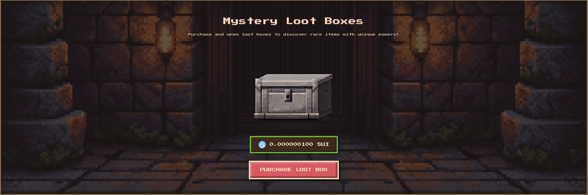
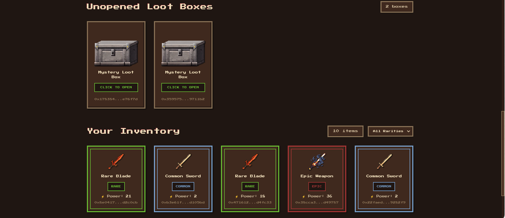
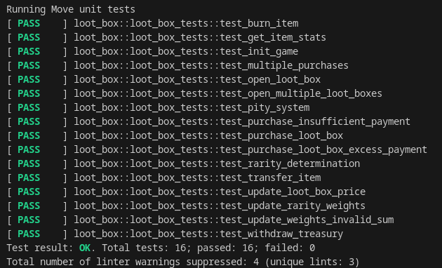

# 🏰 Dungeon of Relics - Blockchain Loot Box System

A decentralized, verifiable loot box system built on the **Sui Blockchain**, featuring a retro pixel-art aesthetic, NFT integration, and a fairness-guaranteed pity system.


## 🌟 Key Features

### 🎲 Verifiable On-Chain Randomness

Utilizes Sui's native `sui::random` module to ensure that every loot box opening is cryptographically fair and tamper-proof. No off-chain oracles required.

### 🛡️ Pity System (Fairness Guarantee)

Implemented a sophisticated pity system using dynamic fields on the shared `GameConfig` object.

- **Mechanism**: Tracks the number of consecutive non-Legendary openings for each user.
- **Guarantee**: If a player opens **30** boxes without receiving a Legendary item, the **31st** box is guaranteed to be Legendary.
- **Reset**: The counter resets automatically upon receiving a Legendary item (either by luck or pity).

### 🖼️ NFT Metadata & Display Standard

Every item received is a fully compliant Sui NFT (`GameItem`) with on-chain metadata.

- **Sui Display Standard**: Integrated `sui::display` so items render perfectly in wallets (Sui Wallet, Suiet, etc.) and explorers.
- **Dynamic Images**: Items have unique image URLs based on their rarity tier.
- **Detailed Attributes**: Metadata includes Name, Rarity, Power Level, Description, and Project URL.

### 🎨 Sleek Pixel Art UI

A fully responsive, retro-themed web interface built with **React** and **TailwindCSS**.

- **Immersive Experience**: Full-screen video backgrounds, pixel fonts, and sound effects.
- **Components**: Custom-built Shop, Inventory, and Toast notification systems.
- **Mobile Optimized**: Responsive design with a custom hamburger menu for mobile devices.

## 📸 Screenshots

### Purchase & Shop

Buy loot boxes using SUI tokens with a seamless checkout experience.


### Inventory Management

View your collected relics, filter by rarity, and verify ownership on-chain.


## 🛠️ Technical Stack

- **Smart Contract**: Move (Sui Framework)
- **Frontend**: React 18, Vite, TailwindCSS v4
- **Wallet Integration**: @mysten/dapp-kit
- **Assets**: Hosted on ImgBB

## 📊 Rarity Tiers

| Tier          | Chance | Power Range |
| ------------- | ------ | ----------- |
| **Common**    | 60%    | 1 - 10      |
| **Rare**      | 25%    | 11 - 25     |
| **Epic**      | 12%    | 26 - 40     |
| **Legendary** | 3%     | 41 - 50     |

_> Note: Legendary drop rate increases to 100% on the 31st attempt via the Pity System._

## ✅ Testing

The project includes a comprehensive test suite covering all scenarios, including the 30-box pity threshold.

```bash
sui move test
```



## 🚀 Deployment Info (Testnet)

- **Package ID**: `0x06ec4cf04fd461d3f49c5c95cb92d85646c0a79de59f27b4ce0f6f5041e062d7`
- **Game Config**: `0xd0405c7277b456baeb54203713e9e62d8b30d8831770571beb5e53a220d84295`

## 📦 Getting Started

1. **Clone the repo**

   ```bash
   git clone https://github.com/yourusername/loot-box-system.git
   ```

2. **Run the UI**

   ```bash
   cd ui
   npm install
   npm run dev
   ```

3. **Deploy the Contract**
   ```bash
   sui client publish --gas-budget 100000000
   ```

## 👥 Team

- **Abhai Matta**
- **Rishwik Jujjavarapu**

---

_Built for the Alkimi Sui Hackathon 2026_
